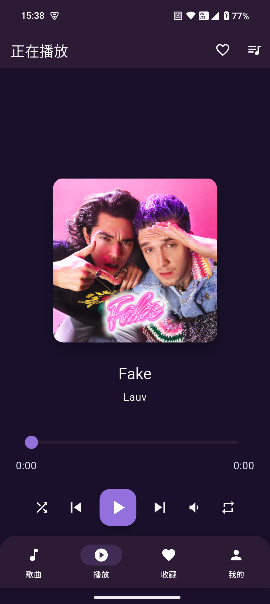

# Vibe Music App

<p align="center">
  
</p>

[English](README_EN.md) | [简体中文](README.md) | [繁體中文](README_ZH_TW.md)

A modern music player application developed with Flutter, designed to connect and play music from the Vibe Music Server.

## Features

- **🎵 Audio Playback**: Supports basic operations like play, pause, previous, next, etc.
- **📱 Responsive Design**: Perfectly adapts to devices with different screen sizes
- **🔄 Playback Control**: Supports various playback modes such as repeat, shuffle, etc.
- **❤️ Favorite Function**: Supports favoriting and unfavoriting songs
- **🔍 Search Function**: Supports searching for songs
- **📋 Playlist**: Display and manage current playlist
- **🎨 Beautiful Interface**: Modern UI design with smooth animation effects
- **🌐 Network Connection**: Connect to Vibe Music Server to get music data
- **👤 User Authentication**: Supports user login and registration functions
- **👨‍💼 Admin Functions**: Supports admin management of users and songs
- **📱 Device Information**: Supports getting device information
- **💾 Local Database**: Supports local data storage

## Technology Stack

- **Framework**: Flutter 3.0+
- **Language**: Dart
- **Audio Playback**: just_audio
- **State Management**: provider
- **Network Request**: dio
- **Image Loading**: cached_network_image
- **Environment Variables**: flutter_dotenv
- **Animation Effects**: Flutter built-in animation + shimmer
- **Icons**: flutter_svg
- **Local Storage**: shared_preferences + sqflite
- **Path Management**: path_provider + path
- **Image Selection**: image_picker
- **Carousel**: carousel_slider
- **Logging**: logger
- **Audio Session**: audio_session
- **Splash Screen**: flutter_native_splash
- **Device Info**: device_info_plus
- **Code Generation**: freezed

## App Showcase

### Mobile Screenshots

Here are screenshots of the app on mobile devices:

| Home | Player Page | Favorites Page |
|------|------------|----------------|
|  |  |  |

## Installation and Running

### Prerequisites

- Flutter SDK 3.0 or higher
- Dart SDK 3.0 or higher
- Android Studio or VS Code (recommended)
- Emulator or real device

### Steps

1. **Clone the repository**

```bash
git clone https://gitee.com/jason_kwok35/vibe-music-app
cd vibe_music_app
```

2. **Install dependencies**

```bash
flutter pub get
```

3. **Configure environment variables**

- Copy `.env.example` file to `.env`
- Modify the configuration in `.env` file according to actual situation

4. **Run the app**

```bash
# Run on emulator or connected device
flutter run

# Run on specific device
flutter run -d <device-id>
```

## Project Structure

```
vibe_music_app/
├── android/          # Android platform-specific code
├── ios/              # iOS platform-specific code
├── linux/            # Linux platform-specific code
├── macos/            # macOS platform-specific code
├── web/              # Web platform-specific code
├── windows/          # Windows platform-specific code
├── lib/              # Flutter source code
│   ├── src/          # Source code directory
│   │   ├── components/     # Common components
│   │   │   ├── common_button.dart
│   │   │   ├── common_card.dart
│   │   │   ├── common_loading.dart
│   │   │   └── pull_to_refresh.dart
│   │   ├── models/         # Data models
│   │   │   ├── song_model.dart
│   │   │   └── user_model.dart
│   │   ├── pages/          # Pages
│   │   │   ├── admin/      # Admin pages
│   │   │   ├── auth/       # Authentication pages
│   │   │   │   ├── login/  # Login page
│   │   │   │   └── register/# Register page
│   │   │   ├── favorites/  # Favorites page
│   │   │   ├── home/       # Home page
│   │   │   ├── player/     # Player page
│   │   │   └── search/     # Search page
│   │   ├── providers/      # State management
│   │   │   ├── auth_provider.dart
│   │   │   └── music_provider.dart
│   │   ├── routes/         # Route configuration
│   │   ├── services/       # Service classes
│   │   │   ├── api_service.dart
│   │   │   └── image_preload_service.dart
│   │   ├── theme/          # Theme configuration
│   │   └── utils/          # Utility classes
│   │       ├── app_logger.dart
│   │       ├── database/   # Database utilities
│   │       ├── deviceInfoUtils/# Device information
│   │       ├── di/         # Dependency injection
│   │       ├── glass_morphism/# Glass morphism effects
│   │       ├── snackbar_manager.dart
│   │       └── sp_util.dart
│   └── main.dart           # App entry point
├── assets/           # Static assets
│   └── images/       # Image assets
├── .env              # Environment variables configuration
├── pubspec.yaml      # Dependency configuration
├── README.md         # Project documentation (Chinese)
├── README_EN.md      # Project documentation (English)
├── README_ZH_TW.md   # Project documentation (Traditional Chinese)
├── BUG_REPORT.md     # Bug report template
└── TODO_LIST.md      # Development task list
```

### Core Module Description

#### Data Layer (`lib/src/data/database/`)

The app uses local database to store data, including the following Data Access Objects (DAO) and entities:

- **DAO**:
  - `play_history_dao.dart` - Play history
  - `playlist_dao.dart` - Playlist
  - `playlist_song_dao.dart` - Playlist-song association
  - `song_dao.dart` - Song data
  - `user_dao.dart` - User data

- **Entities**:
  - `play_history_entity.dart`
  - `playlist_entity.dart`
  - `playlist_song_entity.dart`
  - `song_entity.dart`
  - `user_entity.dart`

#### Page Module (`lib/src/pages/`)

Organized using MVC architecture pattern:

- **admin/** - Admin function pages, including user and song management
- **auth/** - User authentication pages, including login and registration
- **favorites/** - Favorites management page
- **home/** - App home page, including current play bar and song list
- **player/** - Player page, including play control, progress bar, volume control, etc.
- **search/** - Search function page

#### Service Layer (`lib/src/services/`)

- `api_service.dart` - API network request service
- `image_preload_service.dart` - Image preloading service

#### Utility Classes (`lib/src/utils/`)

- **database/** - Database management utilities
- **deviceInfoUtils/** - Device information retrieval (supports Android, iOS, Web)
- **di/** - Dependency injection
- **glass_morphism/** - Glass morphism effect components
- `app_logger.dart` - App logging
- `snackbar_manager.dart` - Message prompt management
- `sp_util.dart` - SharedPreferences utility

## Configuration Instructions

### Environment Variables (.env)

The project uses `.env` file to manage environment variables, mainly including:

```env
# API Base URL
BASE_URL=http://your-server-address:8080

# API Timeout (milliseconds)
API_TIMEOUT=30000

# Base IP Address (used to replace image URLs in responses)
BASE_IP=http://your-server-address
```

### Build Configuration

#### Android

- **Minimum SDK Version**: 21
- **Target SDK Version**: According to Flutter configuration
- **Build Types**: Supports debug and release modes

#### iOS

- **Minimum iOS Version**: 11.0
- **Build Configuration**: Supports debug and release modes

#### Web

- **Build Configuration**: Supports debug and release modes

#### Linux

- **Build Configuration**: Supports debug and release modes

#### macOS

- **Build Configuration**: Supports debug and release modes

#### Windows

- **Build Configuration**: Supports debug and release modes

## Build and Deployment

### Build APK

```bash
# Build release version of APK
flutter build apk --release

# Build split APK (smaller size)
flutter build apk --split-per-abi
```

### Build iOS

```bash
# Build release version of iOS app
flutter build ios --release
```

### Build Web

```bash
# Build Web version
flutter build web
```

### Build Linux

```bash
# Build Linux version
flutter build linux
```

### Build macOS

```bash
# Build macOS version
flutter build macos
```

### Build Windows

```bash
# Build Windows version
flutter build windows
```

## Development Guide

### Code Style

- Follow Flutter official code style guidelines
- Use `flutter format` to format code
- Use `flutter analyze` for code analysis

### Project Architecture

This project uses MVC architecture pattern to organize code structure:

- **Model**: Define data structures, such as `song_model.dart`, `user_model.dart`
- **View**: Page UI implementation, located in `widgets/view.dart` of each page
- **Controller**: Business logic processing, located in `widgets/controller.dart` of each page

### Debugging Tips

- Use VS Code or Android Studio's Flutter plugin for debugging
- Use `flutter run --debug` to run debug version
- Use logging tools in `app_logger.dart` to output debug information
- Check `debug_output.txt` for runtime debug information

### Common Issues

1. **Build Failure**: Check Flutter SDK version and dependency configuration
2. **Network Request Failure**: Check BASE_URL configuration in `.env` file
3. **Audio Playback Failure**: Check audio file format and network connection
4. **Insufficient Memory**: Try cleaning cache and optimizing code
5. **Playback duration shows 0 when starting app for the second time**: Refer to known issues in BUG_REPORT.md
6. **UI not updating after deleting songs from playlist**: Refer to known issues in BUG_REPORT.md

## Task Management

The project uses `TODO_LIST.md` file to manage development tasks, including:

- 🏗️ Development tasks
- 🐛 Fix tasks
- 🎨 UI/UX optimization
- 📱 Platform adaptation
- 🚀 Performance optimization
- 📝 Documentation tasks

Each task has status description and priority identification.

## Contribution Guide

1. **Fork the repository**
2. **Create a branch**: `git checkout -b feature/your-feature`
3. **Commit changes**: `git commit -m "Add your feature"`
4. **Push branch**: `git push origin feature/your-feature`
5. **Create Pull Request**

## License

This project adopts a custom non-commercial use license - please refer to the [LICENSE](LICENSE) file for details

### License Features

- **Non-commercial use**: Only allowed for personal, educational, research and other non-commercial purposes
- **Commercial use prohibited**: Prohibited for any commercial purposes
- **Attribution required**: Redistribution must include the license file and retain copyright notices
- **Disclaimer**: Software is provided "as is" without any warranty

## Contact

- Project address: https://gitee.com/jason_kwok35/vibe-music-app
- Issue feedback: https://gitee.com/jason_kwok35/vibe-music-app/issues

## Acknowledgements

Thanks to everyone who contributed to this project!

---

**Enjoy music, enjoy life! 🎧**